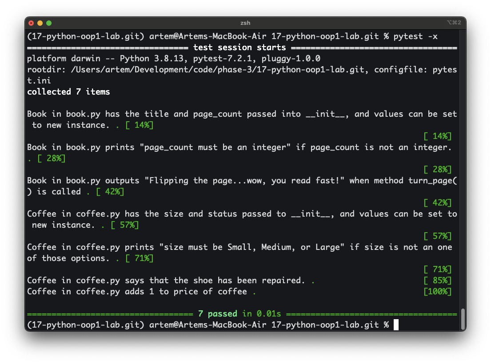

# Bookstore Classes Project

## Overview
This project contains two Python classes: `Book` and `Coffee`.  
`Book` models a book with attributes for title and page count, and includes validation for page count.  
`Coffee` models a coffee order with attributes for size and price, and includes validation for coffee size and a method for adding a tip.

## Features
### Book
- Create a `Book` object with title and page count.
- Automatically validate `page_count` to ensure it is an integer.
- Call `turn_page()` to print: `Flipping the page...wow, you read fast!`.

### Coffee
- Create a `Coffee` object with size (`Small`, `Medium`, `Large`) and price.
- Automatically validate size input.
- Add a tip using the `tip()` method, which increases price by 1.
- Access the coffee’s price via the `.price` attribute.

## Requirements
- Python 3.8 or higher
- `pipenv` for virtual environment management

## Installation

# Clone the repository
[Open repository in browser](https://github.com/ArtRosh/python-oop1-lab.git)


```bash
git clone https://github.com/ArtRosh/python-oop1-lab.git
cd python-oop1-lab

# Install dependencies
pipenv install

# Activate virtual environment
pipenv shell

from lib.book import Book
from lib.coffee import Coffee

# Create a Book instance
b = Book("The Pragmatic Programmer", 352)

# Turn a page
b.turn_page()  # Flipping the page...wow, you read fast!

# Validation demo for Book
b.page_count = "three hundred"  # prints: page_count must be an integer
b.page_count = 353

# Create a Coffee instance
c = Coffee("Medium", 3.50)

# Add a tip
c.tip()  # This coffee is great, here's a tip!

# Print updated price
print(c.price)  # 4.5

# Validation demo for Coffee
c.size = "XL"  # prints: size must be Small, Medium, or Large
c.size = "Large"

Flipping the page...wow, you read fast!
page_count must be an integer
This coffee is great, here's a tip!
4.5
size must be Small, Medium, or Large

## Test Results
